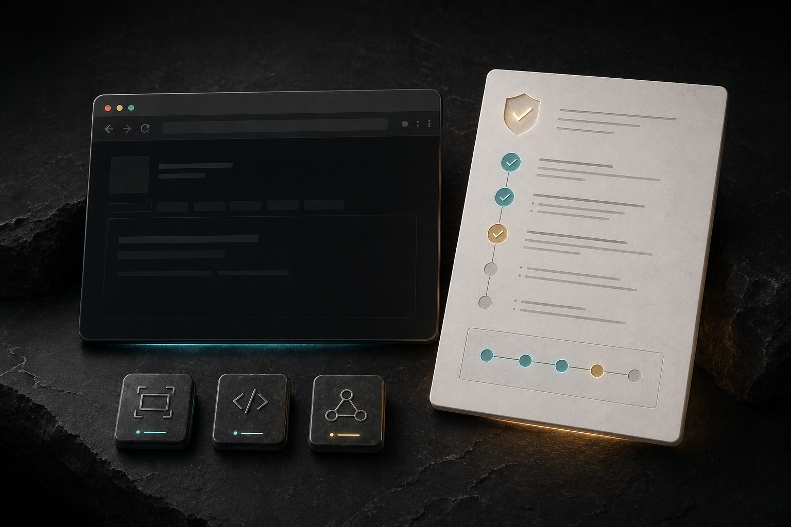

# 

TaskProof turns a browser task spec into inspectable proof.

Give it a target URL and a JSON or YAML spec. TaskProof runs the flow in Playwright, captures screenshots and DOM after every step, records console errors and failed network activity, evaluates assertions, and emits:

- a machine-readable evidence bundle
- a self-contained static HTML report
- a deterministic rerun command and script
- a zipped archive of the full run

If TaskProof saves you debugging time, the smallest support path is the $5 Codex run receipt: <https://nicdunz.gumroad.com/l/smrimu>.

For self-serve browser/account/public-action control templates, use Agent Browser Operator OS: <https://nicdunz.gumroad.com/l/agent-browser-operator-os>.

It is a $39 template kit for approval lanes, proof, handoffs, and go/no-go checks. Public actions stay human-approved. It does not provide account access and does not fix the Codex Chrome plugin, guarantee browser automation, include custom setup, include calls, or provide legal, financial, or security advice.

For a written no-call audit of a TaskProof report bundle or UI task spec, use the paid setup audit path:

- Mini audit: <https://nicdunz.gumroad.com/l/agent-workflow-mini-audit>
- Full workflow audit: <https://nicdunz.gumroad.com/l/agent-workflow-audit>

Redacted report bundles, task specs, screenshots, and public repo links only. Do not send app credentials, private auth flows, tokens, session cookies, secrets, production data, or personal data. No call required.




## Why it lands

Most browser automation tells you whether a run passed. TaskProof is built to show you what actually happened.

It stays intentionally narrow:

- local-first
- no auth
- no database
- no cloud service
- no paid API
- one clear CLI path
- one strong static report

## Proof In This Repo

The repo is set up so the product story is visible immediately:

- [`apps/demo-app`](./apps/demo-app): polished bundled target app used for CI and local evaluation
- [`demo/specs`](./demo/specs): committed task specs against the demo app, including an intentional regression catch
- [`examples/sample-report/README.md`](./examples/sample-report/README.md): committed real proof bundle with explanation
- [`examples/sample-report/bundle.json`](./examples/sample-report/bundle.json): machine-readable source-of-truth evidence
- [`examples/sample-report/logs/console-events.json`](./examples/sample-report/logs/console-events.json): captured console failures
- [`examples/sample-report/logs/network-events.json`](./examples/sample-report/logs/network-events.json): captured failed requests

The canonical sample is deliberate: the spec passes because the UI handles the failing sync path gracefully, while TaskProof still surfaces the failed request and console errors that caused it.

## Quickstart

```bash
npm install
npx playwright install chromium
npm run demo:eval
```

Then open `./artifacts/demo-eval/report/index.html` from disk.

Useful next commands:

```bash
npm run demo:app
npm run taskproof -- --help
npm run validate
npm run showcase:refresh
```

- `npm run demo:app`: runs the bundled demo target on `http://127.0.0.1:43173`
- `npm run validate`: runs lint, typecheck, tests, e2e, and build
- `npm run showcase:refresh`: rebuilds the sample report and README assets

## CLI

Direct example against the bundled demo:

```bash
npm run taskproof -- run \
  --url http://127.0.0.1:43173 \
  --spec ./demo/specs/diagnostics-sync.yaml \
  --out ./artifacts/manual-run
```

Example against your own local app:

```bash
npm run taskproof -- run \
  --url http://127.0.0.1:3000 \
  --spec ./specs/login-smoke.yaml \
  --out ./taskproof-runs/login-smoke
```

Supported steps:

- `click`
- `fill`
- `press`
- `navigate`
- `wait`
- `assertText`
- `assertVisible`
- `assertUrl`
- `assertCount`

Example spec:

```yaml
name: Diagnostics sync captures backend failure
steps:
  - type: click
    selector: '[data-testid="view-diagnostics"]'
  - type: click
    selector: '[data-testid="run-sync"]'
  - type: wait
    ms: 600
  - type: assertText
    selector: '[data-testid="sync-status"]'
    text: 'Sync failed gracefully.'
    match: exact
```

## Example Report


The committed sample proof lives in [`examples/sample-report`](./examples/sample-report).

- Open [`examples/sample-report/report/index.html`](./examples/sample-report/report/index.html) locally to inspect the live report UI.
- GitHub will show the HTML source, not the rendered report.
- The raw proof bundle is committed alongside it for inspection and diffing.

## Example Demo Target


The bundled demo app is intentionally real enough to exercise the harness:

- URL-changing views for `assertUrl`
- deterministic `data-testid` hooks
- task creation and completion flows
- filter controls and count assertions
- a diagnostics path that intentionally emits failed network and console evidence

## What A Run Writes

```text
<run-output>/
  bundle.json
  spec.json
  rerun.sh
  artifacts/
    screenshots/
    dom/
  logs/
    console-events.json
    network-events.json
  report/
    index.html
    assets/
  taskproof-evidence.zip
```

`bundle.json` is the source-of-truth artifact. The HTML report is a projection of that bundle for human review.

## Architecture


1. TaskProof validates and normalizes the task spec.
2. The runner drives the target app with Playwright.
3. Every step records timing, assertions, DOM, screenshots, console, and network failures.
4. The report generator emits a static self-contained HTML report.
5. The full run is zipped for deterministic sharing and reruns.

## Validation

These are the expected local quality signals:

```bash
npm install
npx playwright install chromium
npm run validate
npm run demo:eval
```

GitHub Actions runs the same core path from [`.github/workflows/ci.yml`](./.github/workflows/ci.yml).

## Assets

Generated showcase assets live in [`examples/assets`](./examples/assets):

- `taskproof-logo.svg`
- `social-preview.png`
- `generated/taskproof-hero.png`
- `demo-app.png`
- `report-overview.png`
- `demo.gif`
- `architecture.svg`

Refresh them with:

```bash
npm run showcase:refresh
```

That flow expects `ffmpeg` on your `PATH` for GIF generation.

## License

MIT
