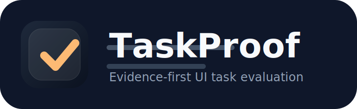
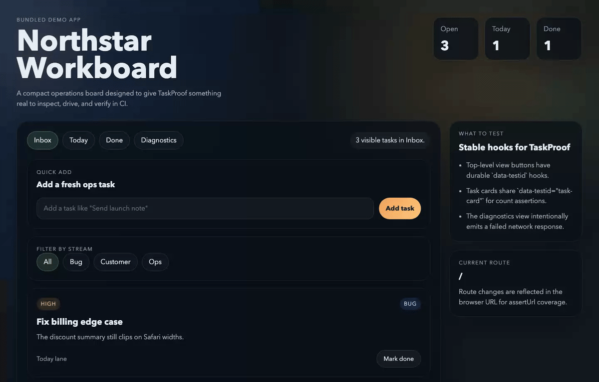
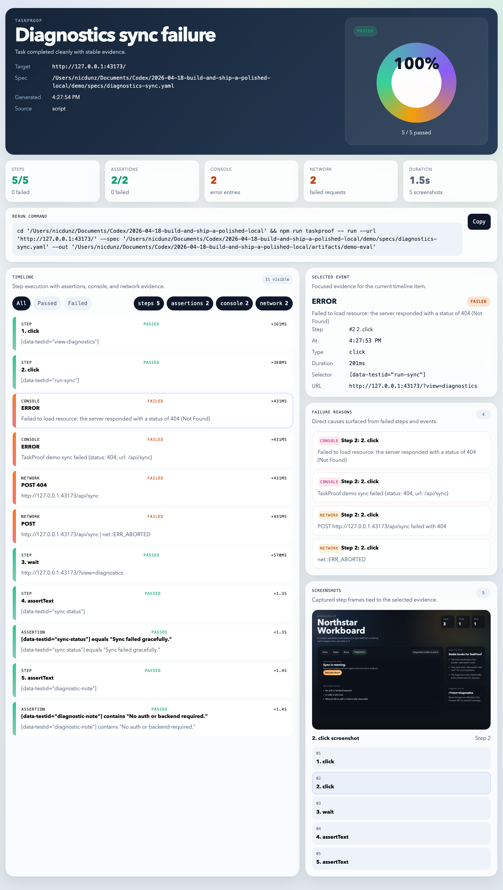
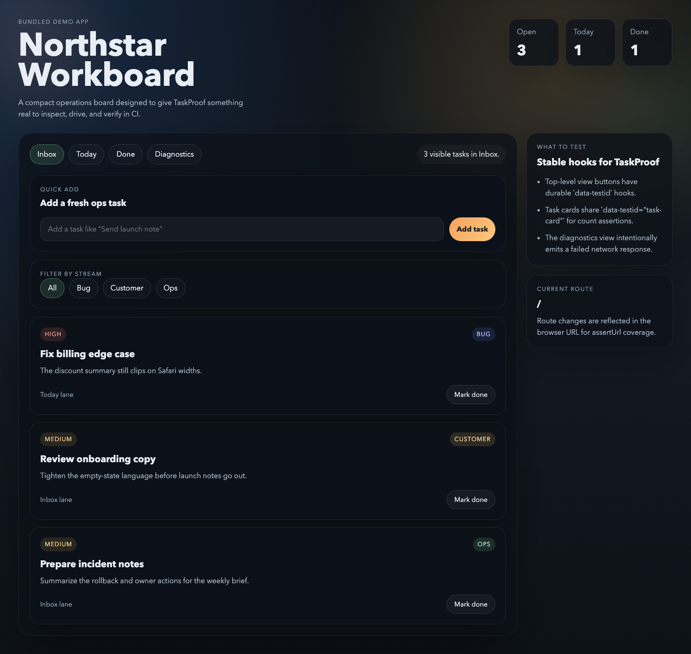
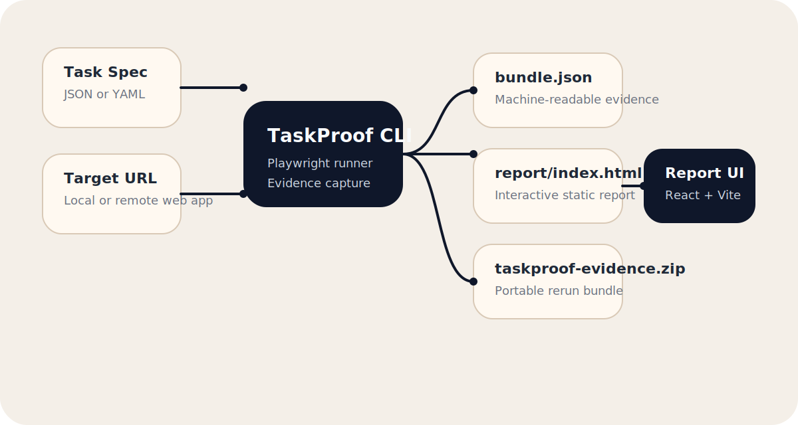

# 

TaskProof is a local-first evidence harness for web UI tasks.

Give it a target URL and a JSON or YAML task spec. TaskProof runs the flow in Playwright, captures screenshots and DOM after every step, records console errors and failed network activity, evaluates assertions, and emits:

- a machine-readable evidence bundle
- a self-contained interactive HTML report
- a deterministic rerun command
- a zipped archive of the full run



## Why it exists

Most browser automation tools tell you whether a run passed. TaskProof is built to show you why.

It keeps the scope narrow on purpose:

- fully local
- no auth
- no database
- no cloud dependency
- no paid APIs
- one good CLI path
- one good static report

## What ships in this repo

- `packages/taskproof`: the Node CLI and Playwright runner
- `apps/report-ui`: the React + Vite report app that gets inlined into each generated report
- `apps/demo-app`: a polished bundled demo target used for CI and local evaluation
- `demo/specs`: seven bundled task specs against the demo app, including an expected-failure regression spec
- `examples/sample-report`: a committed real evidence bundle generated by `npm run demo:eval`

## Quickstart

```bash
npm install
npx playwright install chromium
npm run demo:eval
```

That produces a local run at `artifacts/demo-eval/`.

Useful next commands:

```bash
npm run demo:app
npm run dev
npm run build
```

- `npm run demo:app`: runs the bundled demo target on `http://127.0.0.1:43173`
- `npm run demo:eval`: builds the report UI, boots the demo app if needed, runs TaskProof, and writes the canonical demo output
- `npm run dev`: starts the report UI in Vite dev mode
- `npm run build`: builds the CLI, demo app, and report UI

## Example Report



The committed sample report lives at [`examples/sample-report/report/index.html`](./examples/sample-report/report/index.html).

It is self-contained and works from disk, not just behind a local web server.

## Example Demo Target



The bundled demo app is intentionally real enough to exercise the harness:

- URL-changing views for `assertUrl`
- deterministic `data-testid` hooks
- task creation and completion flows
- filter controls and count assertions
- a diagnostics action that intentionally produces both console errors and failed network activity

## CLI

```bash
npm run taskproof -- run --url http://127.0.0.1:43173 --spec ./demo/specs/diagnostics-sync.yaml --out ./artifacts/manual-run
```

Supported steps:

- `click`
- `fill`
- `press`
- `navigate`
- `wait`
- `assertText`
- `assertVisible`
- `assertUrl`
- `assertCount`

Example spec:

```yaml
name: Diagnostics sync failure
steps:
  - type: click
    selector: '[data-testid="view-diagnostics"]'
  - type: click
    selector: '[data-testid="run-sync"]'
  - type: wait
    ms: 600
  - type: assertText
    selector: '[data-testid="sync-status"]'
    text: 'Sync failed gracefully.'
    match: exact
```

## Output Contract

Each run writes one canonical directory:

```text
<run-output>/
  bundle.json
  spec.json
  rerun.sh
  artifacts/
    screenshots/
    dom/
  logs/
    console-events.json
    network-events.json
  report/
    index.html
    assets/
  taskproof-evidence.zip
```

`bundle.json` is the source-of-truth machine-readable artifact. The report is a projection of that bundle for human review.

## Architecture



1. TaskProof validates and normalizes the task spec.
2. The runner drives the target app with Playwright.
3. Every step records timing, assertions, DOM, screenshots, console, and network failures.
4. The report generator emits a static self-contained HTML report.
5. The entire run is zipped for deterministic sharing and reruns.

## Validation

These commands are expected to pass:

```bash
npm install
npm run lint
npm run typecheck
npm run test
npm run e2e
npm run build
npm run demo:eval
```

GitHub Actions runs the same path in `.github/workflows/ci.yml`.

## Local Assets

Generated README assets live in `examples/assets/`:

- `taskproof-logo.svg`
- `social-preview.png`
- `demo-app.png`
- `report-overview.png`
- `demo.gif`
- `architecture.svg`

If you want to refresh them after changing the UI:

```bash
node ./scripts/generate-readme-assets.mjs
```

## License

MIT
